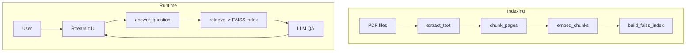

# Chat-over-PDF

Chat with your PDFs using FAISS retrieval and a language model in a Streamlit app.

## Architecture



## How to run locally

1. Install dependencies
   ```bash
   pip install -e .
   ```
2. Place your PDFs in `data/raw/` and build the index
   ```bash
   python app/build_index.py data/raw/*.pdf
   ```
   Pages without extractable text are OCRed automatically using Tesseract.
3. Start the app
   ```bash
   streamlit run app/main.py
   ```
   Use `--local` after `--` to talk to a local LM Studio server:
   ```bash
   streamlit run app/main.py -- --local
   ```

Add `OPENAI_API_KEY` to a `.env` file to use OpenAI embeddings.
