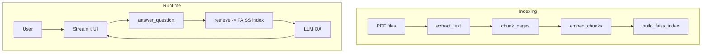

# Chat-over-PDF

Chat with your PDFs using FAISS retrieval and a language model in a Streamlit app.

## Architecture



## How to run locally

1. Install dependencies (requires **Streamlit ≥1.45**)
   ```bash
   pip install -e .
   ```
   If you install packages manually, make sure your Streamlit version is at
   least `1.45`:
   ```bash
   pip install "streamlit>=1.45"
   ```
   Older versions will raise a `TypeError` in `st.set_page_config` due to the
   missing `theme` parameter.
2. Place your PDFs in `data/raw/` and build the index
   ```bash
   python app/build_index.py data/raw/*.pdf
   ```
   Pages without extractable text are OCRed automatically using Tesseract.
3. Start the app
   ```bash
   streamlit run app/main.py
   ```
   Use `--local` after `--` to talk to a local LM Studio server:
   ```bash
   streamlit run app/main.py -- --local
   ```

Add `OPENAI_API_KEY` to a `.env` file to use OpenAI embeddings.
